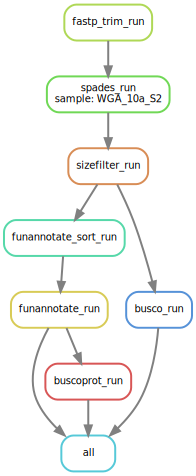

# AAFC Phylogenetic Tree Project Part 2

Welcome to the second phase of our AAFC Phylogenetic Tree Project! This Snakemake workflow is designed to help you assemble genomes, annotate genes, and assess BUSCO scores after quality filtering and contaminant removal from Illumina paired-end reads. Before you begin, please ensure you have Mambaforge installed by following the installation instructions provided here: [Snakemake Setup Guide](https://snakemake.readthedocs.io/en/stable/tutorial/setup.html)

Once you've successfully installed Mambaforge, proceed to create a new conda environment using the provided ```environment.yaml``` file.

## Creating the Environment

We recommend using Mamba or Micromamba to create a conda environment that houses all the necessary tools for this analysis. Follow these commands to set up the environment and activate it for your analysis:

```bash
micromamba create -n AAFC_assembly_annotation_env --file environment.yaml
micromamba activate AAFC_assembly_annotation_env
```

## Creating the Configuration File

Details about creating the configuration file will be provided shortly.

## Running the Pipeline

Our pipeline performs various essential tasks, including trimming and filtering Illumina reads, genome assembly, gene annotation, and assessing BUSCO scores for genomes and gene annotations. Here's an overview of the steps involved:

1. Trim the Illumina reads and filter them for quality using FastP.
2. Normalize Illumina reads using BBnorm.
3. Remove possible contaminants using Kraken2.
4. Assemble genomes using the Spades assembler.
5. Filter contigs based on their sizes using Seqkit.
6. Annotate genes using Funannotate, with evidential support from transcriptional and protein datasets.

### Important Note

Throughout the filtering process, it is vital to create FastQC reports at each step. These reports help you track changes in the dataset and assess whether it remains suitable for assembly.

### Workflow



- Start with a dry run for a specific target sample ID:

```bash
# snakemake -np funannotate/{sample}_annotation > dry_run.out
# Change {sample} to your target ID.
snakemake -np funannotate/WGA_10a_S2_annotation > dry_run.out
```

- Visualize the Directed Acyclic Graph (DAG) for the pipeline:

```bash
# snakemake funannotate/{sample}_annotation --dag | dot -Tsvg > dag.svg
# Change {sample} to your target ID.
snakemake funannotate/WGA_10a_S2_annotation --dag | dot -Tsvg > dag.svg
```

- If dry run completes without a problem and everything looks as expected in the DAG, you can proceed to run the pipeline:

```bash
# snakemake funannotate/{sample}_annotation --cores
# Change {sample} to your target ID.
snakemake funannotate/WGA_10a_S2_annotation --cores
```

## Next steps

After running this pipeline for all samples and obtaining gene annotations, it's time to identify orthologous proteins between samples. Run OrthoFinder using the detailed instructions found [here](https://github.com/davidemms/OrthoFinder). I suggest using the Orthofinder docker container for this step.

Once orthologous groups are identified, the next part of this pipeline can be run to construct the phylogenetic tree.

## Citations

This part will be updated soon!