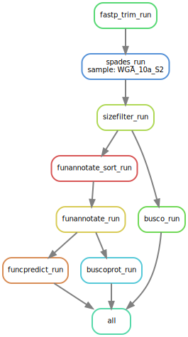

# AAFC Phylogenetic Tree Project Part 1

Welcome to the first phase of our AAFC Phylogenetic Tree Project! This Snakemake workflow is designed to help you assemble genomes, annotate genes, and assess BUSCO scores after quality filtering and contaminant removal from Illumina paired-end reads. Before you begin, please ensure you have Mambaforge installed by following the installation instructions provided here: [Snakemake Setup Guide](https://snakemake.readthedocs.io/en/stable/tutorial/setup.html)

Once you've successfully installed Mambaforge, proceed to create a new conda environment using the provided ```environment.yaml``` file.

## Creating the Environment

We recommend using Mamba or Micromamba to create a conda environment that houses all the necessary tools for this analysis. Follow these commands to set up the environment and activate it for your analysis:

```bash
micromamba create -n AAFC_assembly_annotation_env --file environment.yaml
micromamba activate AAFC_assembly_annotation_env
```

## Requirements and Dependencies for the Workflow

### Databases

This workflow requires the Kraken2 standard database and BUSCO fungi odb10 database. Instructions for downloading the Kraken2 databases can be found [here](https://github.com/DerrickWood/kraken2) and instructions for downloading BUSCO databases can be found [here](https://gitlab.com/ezlab/busco). Please note the location of these databases to modify the ```config.yaml``` file before running the pipeline.

### Dependencies

InterProScan5 cannot be incorporated into the ```funannotate annotate``` because InterProScan5 is Linux only. Detailed information can be found [here](https://funannotate.readthedocs.io/en/latest/annotate.html). The best way to use this tool is using its [docker image]be found [here](https://hub.docker.com/r/interpro/interproscan). The output of this tool is an XML file, note its location to modify the ```config.yaml``` file.

## Modifying the Configuration File

### 1. Modifying the Sample ID

Set the unique sample ID for the run. Leave no spaces.

```yaml
samples:
  WGA_10a_S2
```

### 2. Specifying the Number of Threads

Specify the number of threads you want to use:

```yaml
threads: 16
```

### 3. Identify and Underline the Species Name

Set the species name and its underlined version:

```yaml
species: Acaulospora delicata
underlined_species: Acaulospora_delicata
```

### 4. Specify the Interproscan XML Output Path

This is required for the functional annotation, set the path to the XML output file:

```yaml
iprscan_xml: funannotate/Acaulospora_delicata.proteins.fa.xml
```

### 5. Specify Busco ODB and its Path

Specify the name of the BUSCO ODB you want to use and set the path to this ODB:

```yaml
busco_odb_id: fungi_odb10
busco_odb_path: ../fungi_odb10
```

### 6. Specify the path to Transcript and Protein Evidence

Set the path to both evidences:

```yaml
trinity_ev: funannotate/transcript_evidence/WGA_10a_S2/trinity_out_dir.Trinity.fasta
protein_ev: funannotate/protein_evidence/WGA_10a_S2/sequence.fasta
```

### 7: Specify the path to your Kraken2 standard database in scripts/fastp_trim.sh script

The last thing to do is to modify the ```scripts/fastp_trim.sh``` by setting the path to the Kraken2 standard database.

```shell
# You need to change the Kraken2 db path here (modify kraken2_standard_db)
for fff1 in bbnormed_trimmed_*_R1.fastq.gz
do
    fff2=${fff1%%_R1.fastq.gz}"_R2.fastq.gz"
    readkraken=${fff1%%_R1.fastq.gz}"#_krakened.fastq.gz"
    reportkraken=${fff1%%_R1.fastq.gz}"_report.txt"
    kraken2 -db kraken2_standard_db --threads 16 --unclassified-out $readkraken \
    --gzip-compressed --paired $fff1 $fff2 --report ../qc/$reportkraken
done
```

## Running the Pipeline

Our pipeline performs various essential tasks, including trimming and filtering Illumina reads, genome assembly, gene annotation, and assessing BUSCO scores for genomes and gene annotations. Here's an overview of the steps involved:

1. Trim the Illumina reads and filter them for quality using FastP.
2. Normalize Illumina reads using BBnorm.
3. Remove possible contaminants using Kraken2.
4. Assemble genomes using the Spades assembler.
5. Filter contigs based on their sizes using Seqkit.
6. Annotate genes using Funannotate, with evidential support from transcriptional and protein datasets.
7. Complete functional annotations using Funannotate after running InterProScan5.

The last step in this workflow is specifically designed for NCBI submissions. However, if functional annotations are not necessary for your project, you can skip this step.

To customize the workflow based on your project's requirements:
1. Open the ```Snakefile```.
2. Look for the section containing the two ```rule_all``` rules.
3. If functional annotations are not needed, maintain the first ```rule_all``` rule and comment out the second one.
4. If functional annotations are required, simply reverse the commenting, commenting out the first ```rule_all``` and uncommenting the second one.


### Part 1 of the Workflow - Structural Gene Annotations

```python
# This rule is for structural gene annotations
rule all:
    input:
        expand(
            "funannotate/{sample}_annotation/predict_results",
            sample=config["samples"],
        ),
        expand("busco_results/{sample}_geno", sample=config["samples"]),
        expand("busco_results/{sample}_prot", sample=config["samples"]),
```

### Part 2 of the Workflow - Functional Gene Annotations

```python
# This rule is for functional gene annotations
rule all:
    input:
        expand(
            "funannotate/{sample}_annotation/annotate_results",
            sample=config["samples"],
        )
```

Ensure that you have executed the ```InterProScan5``` tool using Docker, as specified in the dependencies section of this workflow. This tool is crucial for the subsequent steps of functional annotation. The XML output file generated during this process will be used here.

After running ```InterProScan5```, update the ```config.yaml``` file with the correct path to the generated XML output file. This path is essential for seamless integration into the functional annotation workflow.

### Important Note

Throughout the filtering process, it is crucial to generate FastQC reports at each step. These reports serve as valuable tools for monitoring changes in the dataset and assessing its suitability for assembly.

You can access the FastQC reports in the ```Illumina_reads/qc/``` folder. Reviewing these reports provides insights into the dataset's quality evolution, enabling informed decisions during the assembly process.

## Workflow



- Start with a dry run:

```bash
# snakemake -np > dry_run.out
# Change the sample ID in the config.yaml file with your target ID.
snakemake -np funannotate/WGA_10a_S2_annotation > dry_run.out
```

- Visualize the Directed Acyclic Graph (DAG) for the pipeline:

```bash
# snakemake --dag | dot -Tsvg > dag.svg
# Change the sample ID in the config.yaml file with your target ID.
snakemake funannotate/WGA_10a_S2_annotation --dag | dot -Tsvg > dag.svg
```

- If dry run completes without a problem and everything looks as expected in the DAG, you can proceed to run the pipeline:

```bash
# snakemake --cores
# Change the sample ID in the config.yaml file with your target ID.
snakemake funannotate/WGA_10a_S2_annotation --cores
```

## Next steps

After running this pipeline for all samples and obtaining gene annotations, it's time to identify orthologous proteins between samples. Run OrthoFinder using the detailed instructions found [here](https://github.com/davidemms/OrthoFinder). I suggest using the Orthofinder docker container for this step.

Once orthologous groups are identified, the next part of this pipeline can be run to construct the phylogenetic tree.

## Citations

This part will be updated soon!
